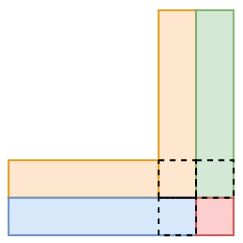

# 221. Maximal Square

Difficulty: Medium
ID: 221
Solved?: Yes
Tags: DP
击败: 21
推荐指数: ⭐⭐⭐⭐

[Maximal Square - LeetCode](https://leetcode.com/problems/maximal-square/)

## 题意

Given a 2D binary matrix filled with 0's and 1's, find the largest square containing only 1's and return its area.

**Example:**

```
Input: 

1 0 1 0 0
1 0 1 1 1
1 1 1 1 1
1 0 0 1 0

Output: 4

```

## 思路

1. 二维DP：dp(r, c)表示以坐标(r, c)作为右下角的正方形的最大边长。dp递推式：
    
    dp(r, c) = min(dp(r-1, c-1), dp(r, c-1), dp(r-1, c)) + 1
    
    比如取MIN之后的结果：以(r-1, c-1)为展开点，看右侧绿色，看下侧蓝色，都是1，再加上红色自己的1，那么就可以从(r-1, c-1)往右下方扩展一层。
    
    
    

## 题解

```python
class Solution:
    def maximalSquare(self, matrix: List[List[str]]) -> int:
        if not matrix or not matrix[0]: return 0
        M, N = len(matrix), len(matrix[0])
        G = {(r, c): 0 for r in range(M) for c in range(N) if matrix[r][c] == '0'}
        
        def dp(G, r, c):
            p = r, c
            if p in G: return G[p]
            if r < 0 or r >= M: return 0
            if c < 0 or c >= N: return 0
            G[p] = min(dp(G, r-1, c-1), dp(G, r, c-1), dp(G, r-1, c)) + 1
            return G[p]
        
        return max([dp(G, r, c) for r in range(M) for c in range(N)], default=0) ** 2
```

击败21%

非递归应该好很多