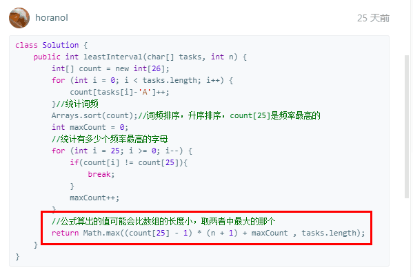

# 621. Task Scheduler

Difficulty: Medium
ID: 621
Solved?: No
推荐指数: ⭐⭐⭐⭐

[Task Scheduler - LeetCode](https://leetcode.com/problems/task-scheduler/)

这个解的巧妙呀
它的思路是将最高频的铺开来（间隔n，中间还有很多空位），定位打桩，将其余元素一个个插进来。
最后的排列结果可能是：如果n比较大，中间铺不满，会有空隙，那么总长度就由最高频决定；如果n比较小，全部铺满，不会有空隙，那么总长度就是任务个数