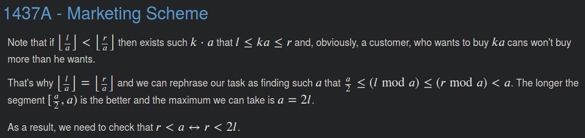

# 1437A - Marketing Scheme

ID: 1437
Tags: brute force, constructive algorithms, greedy, math
github: No
已解: Yes
推荐指数: ⭐⭐⭐
难度: 800

[Problem - 1437A - Codeforces](https://codeforces.com/problemset/problem/1437/A)

## 思路

1. 贪心：总是取a = r + 1，使得[l, r]的模子集落在区间[a/2, a/2+1, ..., r]里。右边界已经对齐，只要比较数量即可。



## 题解

```python
def solve():
    L, R = read_ints()
    a = R + 1
    if R - L <= a - 1 - math.ceil(a / 2):
        YES()
    else:
        NO()
```