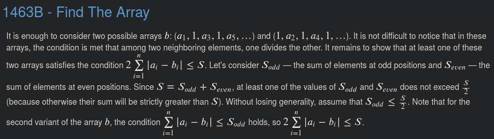

# 1463B - Find The Array

ID: 1463
Tags: bitmasks, constructive algorithms, greedy
github: No
已解: Yes
推荐指数: ⭐⭐⭐⭐
难度: 1400

[Problem - 1463B - Codeforces](https://codeforces.com/problemset/problem/1463/B)

## 思路



## 题解

```python
def solve():
    n = read_int()
    A = read_ints()
    odd = 0
    even = 0
    for i, x in enumerate(A):
        if i % 2:
            odd += x
        else:
            even += x
    B = A[:]
    for i in range(n):
        if odd < even and i % 2 == 1:
            B[i] = 1
        elif even <= odd and i % 2 == 0:
            B[i] = 1
    print_nums(B)
```