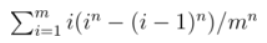

# 453A. Little Pony and Expected Maximum

ID: 453
Tags: probabilities
github: No
已解: Yes
推荐指数: ⭐⭐⭐⭐
难度: 1600

[Problem - 453A - Codeforces](https://codeforces.com/problemset/problem/453/A)

[Codeforces Round #259 Editorial - Codeforces](https://codeforces.com/blog/entry/13190)

## 思路

1. 投掷n次带m面的骰子，所有结果有 $m^n$ 种，每一种结果中的最大值作为该次的代表，进行累加。
    
    我们需要统计所有结果中，最大值为k的有多少种。可以这么考虑，最大值为k，每次投掷，结果不能超过k，所以有 $k^n$ 种。但是，其中还包括了不含最大值k的情况，比如全1，这种情况共有 $(k-1)^n$ 种，所以最大值为k的情况有 $k^n - (k - 1)^n$ 种，然后k作为代表，和值就是乘以k。
    
    
    

```python
def main():
    m, n = read_ints()
    total = 0.0
    for i in range(1, m + 1):
        total += i * ((i/m) ** n - ((i-1)/m) ** n)
    print(total)
```