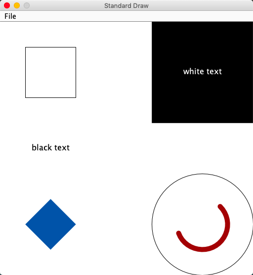

#algorithm #经典 #book

# 《Algorithms》

2019-04-16 22:26:45，基本整理了一遍。algs4/py-code。主要还剩红黑树。

[Algorithms, 4th Edition by Robert Sedgewick and Kevin Wayne](https://algs4.cs.princeton.edu/)

[kevin-wayne/algs4](https://github.com/kevin-wayne/algs4)

[经典算法&数据结构](经典算法&数据结构.md)

[环境准备](《Algorithms》/环境准备%2064dcd48ea4344bed83996c55134167d5.md)

- 如何`直接运行algs4.jar`里的程序
    - 下载两个脚本，放到PATH目录，如~/bin
        - [https://algs4.cs.princeton.edu/mac/java-algs4](https://algs4.cs.princeton.edu/mac/java-algs4)，名字不要改变
        - [https://algs4.cs.princeton.edu/mac/javac-algs4](https://algs4.cs.princeton.edu/mac/javac-algs4)，名字不要改变
    - 修改两个脚本里面的INSTALL变量，指向algs4.jar所在目录，如~/github/algs4
    - 命令行运行，如java-algs4 edu.princeton.cs.algs4.StdDraw，注意包名前缀
        
        
        

## 学习进度

[1. Fundamentals](《Algorithms》/1%20Fundamentals%20846f6538908844ce88c20fe8509bedef.md)

[2. Sorting](《Algorithms》/2%20Sorting%20c31232812105447884bb5307ab2b1a8d.md)

[3. Searching](《Algorithms》/3%20Searching%208d64e843107e4e07a748f6866b6afb00.md)

[4. Graph](《Algorithms》/4_Graph.md)

[5. Strings](《Algorithms》/5_Strings.md)