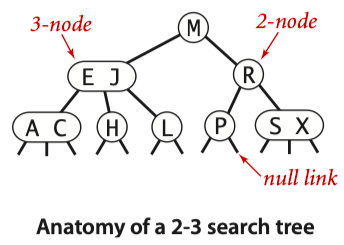
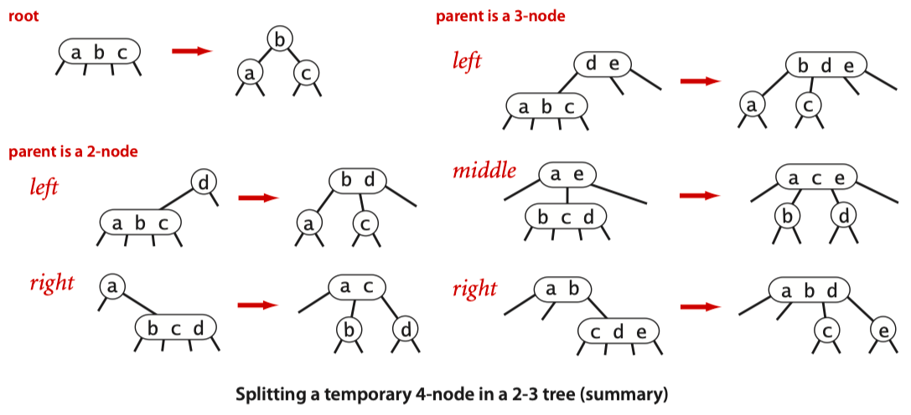

# 2-3 tree

- hold more than one key
- 3-node: 含有2个key，3条link

- A perfectly balanced 2-3 search tree is one whose null links are all the same distance from the root.
- 临时4-node的分裂有6种情况（自底向上）：
    
    
    
    - 局部的变换能保证全局的性质。
    - 2-3树能够保持完全平衡（理解起来容易），但操作起来麻烦且overhead不小，转向红黑树。