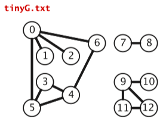
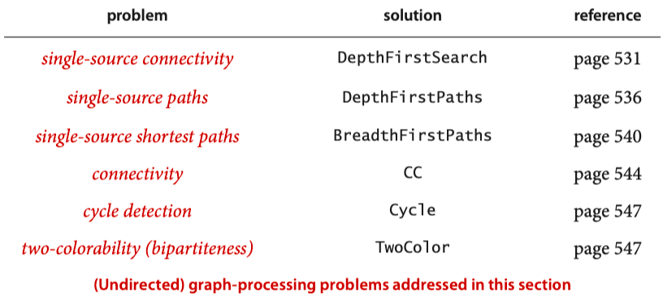
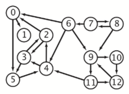
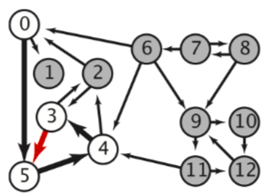
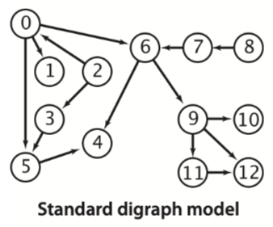
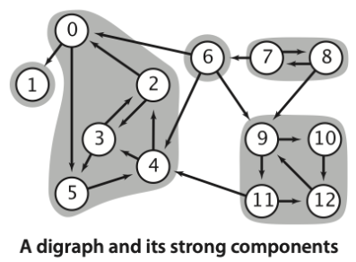
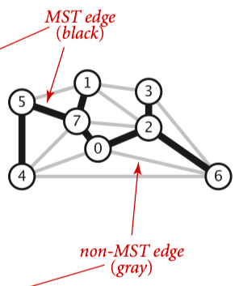

# 4. Graph

## 4.1 Undirected Graphs

- 无向图的表示，algs4/Graph.py 实现参考： [Graph.py](../经典算法&数据结构/图，Graph/无向图/Graph.py.md)
- **`Single-source connectivity`**. Given a graph, support queries of the form *Are two given vertices connected*? and *How many connected components does the graph have*?
    - DFS，algs4/DepthFirstSearch.py 实现参考：[DepthFirstSearch py 96cabfbc5f5c4cd493ade609b66c2c7c](../经典算法&数据结构/图，Graph/无向图/DepthFirstSearch py 96cabfbc5f5c4cd493ade609b66c2c7c.md)
- **`Single-source paths`**. Given a graph and a source vertex s, support queries of the form *Is there a path from s to a given target vertex v*? *If so, find such a path.*
    - DFS，algs4/DepthFirstPaths.py 实现参考： [DepthFirstPaths py 544fd8b596dc421a8080ebb0da91dbfa](../经典算法&数据结构/图，Graph/无向图/DepthFirstPaths py 544fd8b596dc421a8080ebb0da91dbfa.md)
- **`Single-source shortest paths.`** Given a graph and a source vertex s, support queries of the form *Is there a path from s to a given target vertex v*? *If so, find a shortest such path (one with a minimal number of edges)*.
    - BFS，algs4/BreadthFirstPaths.py 实现参考： [BreadthFirstPaths py cb7574fdc33a4ee884677a0eac3c47a9](../经典算法&数据结构/图，Graph/无向图/BreadthFirstPaths py cb7574fdc33a4ee884677a0eac3c47a9.md)
- **`Connected components`**.
    - DFS，algs4/CC.py 实现参考： [CC.py](../经典算法&数据结构/图，Graph/无向图/CC.py.md)
- **`Cycle detection`**. Support this query: *Is a given graph acylic*?
    - DFS，algs4/Cycle.py 实现参考：[Cycle.py](../经典算法&数据结构/图，Graph/无向图/Cycle.py.md)
- `**Two-colorability**`. Support this query: *Can the vertices of a given graph be assigned one of two colors in such a way that no edge connects vertices of the same color* ? which is equivalent to this question: *Is the graph bipartite* ?
    - DFS，algs4/TwoColor.py 实现参考 [TwoColor.py](../经典算法&数据结构/图，Graph/无向图/TwoColor.py.md)

## 4.2 Directed Graphs

tinyDG.txt，P569

- 有向图的表示，algs4/Digraph.py，实现参考 [Digraph.py](../经典算法&数据结构/图，Graph/有向图 fcd8d82ef9e249989208006acc263189/Digraph.py.md)。
- **`Single-source reachability.`** Given a digraph and a source vertex s, support queries of the form *Is there a directed path from s to a given target vertex v*? 单点向外扩散。
    - **`Multiple-source reachability.`** Given a digraph and a set of source vertices, sup- port queries of the form *Is there a directed path from any vertex in the set to a given target vertex v*? 相当于从一个集合开始向外扩散。
    - DFS, algs4/DirectedDFS.py，跟无图的做法类似，实现参考 [DirectedDFS.py](../经典算法&数据结构/图，Graph/有向图 fcd8d82ef9e249989208006acc263189/DirectedDFS.py.md)。
- **`Single-source directed paths.`** Given a digraph and a source vertex s, support queries of the form *Is there a directed path from s to a given target vertex v*? If so, find such a path.
    - algs4/DepthFirstDirectedPaths.py，与无图类似，实现参考 [DepthFirstDirectedPaths py c7d90b66a971441cb32d5203b57b6c25](../经典算法&数据结构/图，Graph/有向图 fcd8d82ef9e249989208006acc263189/DepthFirstDirectedPaths py c7d90b66a971441cb32d5203b57b6c25.md)。
- **`Single-source shortest directed paths.`** Given a digraph and a source vertex s, support queries of the form *Is there a directed path from s to a given target vertex v*? If so, find a *shortest* such path (one with a minimal number of edges).
    - algs4/BreadthFirstDirectedPaths.py，与无图类似，实现参考 [BreadthFirstDirectedPaths py 30ecb7b111e4498a869a9083583bdff7](../经典算法&数据结构/图，Graph/有向图 fcd8d82ef9e249989208006acc263189/BreadthFirstDirectedPaths py 30ecb7b111e4498a869a9083583bdff7.md)
- Cycle & DAG
- **`Directed cycle detection.`** Does a given digraph have a directed cycle? If so, find the vertices on some such cycle, in order from some vertex back to itself.
    
    
    
    - algs4/DirectedCycle.py，实现参考 [DirectedCycle py d38eedbc665f4953ba4540d600e82680](../经典算法&数据结构/图，Graph/有向图 fcd8d82ef9e249989208006acc263189/DirectedCycle py d38eedbc665f4953ba4540d600e82680.md)
- **`Topological sort.`** Given a digraph, put the vertices in order such that all its directed edges point from a ver- tex earlier in the order to a vertex later in the order (or report that doing so is not possible).
    
    
    
    - 不同的标记顺序：Preorder，Postorder，Reverse postorder
        - 现在有一条边X → Y，DFS遍历的时候，标记顺序有什么潜在关系么？
        - DFS遍历的时候，是随便抓尚未访问的节点，所以可能：
            - 如果X先遍历，进一步发现Y是X的邻节点，所以继续遍历。这种情况下，pre(X) < pre(Y)，也就是前序是X先标记。后序呢？X的后序要等Y返回之后才会标记，所以post(Y) < post(X)，也就是先标记Y。整体顺序是pre(X) < pre(Y) < post(Y) < post(X)。
            - 如果Y先遍历，发现没有邻节点，那么DFS结束返回。接下来继续遍历X，Y虽然是X的邻节点，但已经访问过，所以不会继续。这里的整体顺序是pre(Y) < post(Y) < pre(X) < post(X)。
        - 结论：`边X → Y，能推出post(Y) < post(X)`，也就是要等Y完成后，X才能完成。pre(X)与pre(Y)的前后顺序是不确定的；pre(X)与post(Y)的顺序也是不确定的，因为可能Y先完成再去遍历X。当然，对节点来说，肯定是pre(Z) < post(Z)。
        - algs4/DepthFirstOrder.py，实现参考 [DepthFirstOrder py 6adcde1741a747908d3087e90d478ce3](../经典算法&数据结构/图，Graph/有向图 fcd8d82ef9e249989208006acc263189/DepthFirstOrder py 6adcde1741a747908d3087e90d478ce3.md)
    - 如果有向图是DAG，也就是无环，那么就可以拓扑排序，Reverse postorder就是一种可能的排序（实际是有多种可能排序结果的）。
    - algs4/Topological.py，实现参考 [Topological py 063705e8900f49e5bc1ba0fe16b60161](../经典算法&数据结构/图，Graph/有向图 fcd8d82ef9e249989208006acc263189/Topological py 063705e8900f49e5bc1ba0fe16b60161.md)
- **`Strong connectivity.`** Given a digraph, support queries of the form: *Are two given vertices strongly connected* ? and *How many strong components does the digraph have* ?
    - strongly connected components, SCC
    
    
    
    tinyDG.txt，P584
    
    - `KosarajuSCC`: 考虑G的转置，一个SCC内部是两两互通的，那么转置后，仍然是两两互通的，仍旧是SCC。现在，将一个强连通体视为整体作为一个节点。如果SCC-A有条边指向SCC-B（显然，B不能再有边指向A了，否则两者可以合并成大的SCC了），根据拓扑序，我们应该先遍历SCC-B中的节点，显然它不会进入SCC-A，然后再遍历SCC-A中的节点。否则，先遍历SCC-A的话，会进入SCC-B，造成混乱。所以，遍历的起点很重要。
        - 现在，SCC-A有条边指向了SCC-B，那么postorder的最后一个节点落在A中，而postorder的第一个节点有可能在A中，也有可能在B中，这个是不确定的。
        - 想要抽出SCC-B中的一个点作为端点（起点or终点），考虑下将这条边方向，也就是SCC-B指向了SCC-A，那么postorder时最后一个节点在B中，逆序下就是起点了。
        - agls4/KosarajuSCC.py，实现参考 [KosarajuSCC py 1aeb1e62e1404c83924aba88fba5157b](../经典算法&数据结构/图，Graph/有向图 fcd8d82ef9e249989208006acc263189/KosarajuSCC py 1aeb1e62e1404c83924aba88fba5157b.md)
- 两两节点的连通性？

## 4.3 Minimum Spanning Trees

- edge-weighted graph
- MST：最小生成树，将所有顶点都连接起来的边的权重和值最小。
- 样例图：tinyEWG.txt，P604，考虑无向图，最小权重为1.81
    
    
    
- Prim’s algorithm and Kruskal’s algorithm
- find the MST of a connected edge-weighted graph with arbitrary (but distinct) weights，权重可以为0或者负数。
- **`Proposition J. (Cut property)`** Given any cut in an edge-weighted graph, the crossing edge of minimum weight is in the MST of the graph. 最小割必定属于MST。
- 使用贪心算法。
- allow parallel edges，allow self-loops
- `Prim’s algorithm`
    - algs4/LazyPrimMST.py，实现参考 [LazyPrimMST py 2184e298ebf9400cabb6cac0b96e0c25](../经典算法&数据结构/图，Graph/最小生成树 cda8ee9367464f8499a7547e93044068/LazyPrimMST py 2184e298ebf9400cabb6cac0b96e0c25.md)
- `**Kruskal’s algorithm**`
    - algs4/KruskalMST.py，实现参考 [KruskalMST py d57c8c4d605b497597826d7f59df951d](../经典算法&数据结构/图，Graph/最小生成树 cda8ee9367464f8499a7547e93044068/KruskalMST py d57c8c4d605b497597826d7f59df951d.md)

## 4.4 Shortest Paths

- **`Single-source shortest paths.`** Given an edge-weighted digraph and a source ver- tex s, support queries of the form Is there a directed path from s to a given target vertex t? If so, find a shortest such path (one whose total weight is minimal).
- Dijkstra: 无负边，实现参考 [DijkstraSP py aadcdf4df5164aa08313c8f1eed21eca](../经典算法&数据结构/图，Graph/最短路径 b03120f214344f02b20919c895460329/DijkstraSP py aadcdf4df5164aa08313c8f1eed21eca.md)
- 按拓扑序relax：针对DAG
- bellman-ford: 针对每条边做V-1次releax。