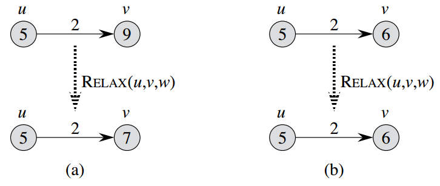

# 第24章 单源最短路径

[24.1 Bellman-Ford算法](第24章_单源最短路径/24%201%20Bellman-Ford算法%20ec43cf2ed31a405aaf4916869d59b717.md)

[24.2 有向无环图中的单源最短路径问题](第24章_单源最短路径/24%202%20有向无环图中的单源最短路径问题%20b86c22b3f6d74d8ea243ac494c9b92d9.md)

[24.3 Dijkstra算法](第24章_单源最短路径/24%203%20Dijkstra算法%20dab7b6ba93a345a7aeca7d2953831e83.md)

[24.4 差分约束和最短路径](第24章_单源最短路径/24%204%20差分约束和最短路径%20c9d8d207c01f4de2b3f3738b52329c13.md)

[24.5 最短路径性质的证明](第24章_单源最短路径/24%205%20最短路径性质的证明%208ea54696ddfb432fa17fec7ae4d56269.md)

---

- 针对一个带权重的有向图G(V, E)，寻找从单点s出发的到其他节点的最短路径。
    - $δ(u, v)$定义为从u出发到v的最短路径，可能有多条。
    - 基于广度优先搜索
    - Dijkstra算法是贪心算法，假设边的权重为非负值。
    - Floyd-Warshall算法则是动态规划算法。
    - Bellman-Ford算法允许权重为负值的边，它能探测到负值的环路存在。
- 最短路径的几个变体
    - 单目的地最短路径问题。方向反过来就是单源最短路径了。
    - 单节点对最短路径问题。也就是从u出发到v的最多路径，跟单源最短路径一样。
    - 所有节点对最短路径问题。见第25章。
- 最短路径的最优子结构：最短路径的子路径也是最短路径。
- `负权重的边`
    - 如果有权重为负值的环路，则最短路径权重无定义。定义 $δ(s, v) = -∞$
    - 不可达节点的最短距离视为正无穷大。
- `环路`
    - 如果有权重为正的环路，自然可以从最短路径上将它摘除。
    - 最短路径也不能包含权重为负值的环路，因为会无限导致负无穷大。
    - 那么权重为0的环路呢？有它没它一样，可以将其摘除。
    - 最终，良好定义的最短路径是简单路径，不存在环。那么，最短路径上最多存在V个点，|V|-1条边。
- 最短路径的表示：使用前驱节点串起来（v.π）
- 形成以s为根节点的最短路径树。
- `松弛操作`
    - 维护每个节点v到源节点s的距离，v.d，称之为s到v的最短路径估计。
    - 松弛操作是为了测试从s到v的最短路径是否有改善。
    
    ```python
    # 初始化
    INITIALIZE-SINGLE-SOURCE(G, s)
    	for each vertex v in G.V
    		v.d = ∞
    		v.π = NIL
    	s.d = 0
    ```
    
    ```python
    # 松弛操作
    RELAX(u, v, w)
    	if u.d + w(u, v) < v.d
    		v.d = u.d + w(u, v)
    		v.π = u
    ```
    
    
    
- 本章算法约定
    - 先调用INITIALIZE-SINGLE-SOURCE来初始化，然后重复对边进行松弛。
    - 松弛是唯一导致最短路径估计和前驱节点发生变化的操作。
    - 本章算法之间的差异是对每条边进行松弛的次数和松弛边的次序有所不同。
    - Dijkstra针对有向无环图的每条边仅松弛一次。
    - Bellman-Ford算法则对每条边松弛|V|-1次。
- 最短路径和松弛操作的性质
    - 三角不等式性质：对任何边(u, v)，有δ(s, v) ≤ δ(s, u) + w(u, v)
    - 上界性质：δ(s, v) ≤ v.d，一旦v.d到达δ(s, v)，其值将不再发生变化。
    - 非路径性质：如果s跟v之间没有路径，则v.d = δ(s, v) = ∞
    - 路径松弛性质：如果p=<v0, v1, ..., vk>是从s=v0到节点vk的一条最短路径，如果按照边的松弛次序为<v0, v1>, <v1, v2>, ..., <vk-1, vk>，那么vk.d = δ(s, vk)，跟其他松弛无关，且可以穿插其他松弛操作。
        - 或者说，沿着最短路径的边进行松弛，肯定能得到最短路径（说法递归了？）。