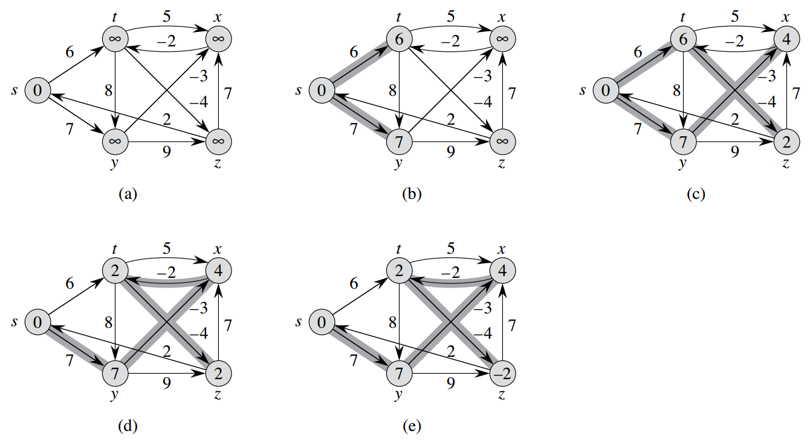

# 24.1 Bellman-Ford算法

- Bellman-Ford算法适用于一般情况的单源最短路径，边的权重可以为负。它能判断是否存在负值的环路。
- Bellman-Ford算法通过松弛操作来渐进地逼近最短路径。因为最短路径最多只有|V|-1条边，那么只用松弛|V|-1轮即可，每一轮对所有边进行松弛。可以简单这么想，隐含的最短路径<v0, v1, ..., vk>按照<v0, v1>, <v1, v2>, ..., <vk-1, vk>的顺序来松弛，每一轮松弛一条边，最终就能到达最短路径了。
- 时间复杂度为O(VE)

---

```python
def initialize_single_source(G, s, D, P):
    for u in G:
        D[u] = float("inf")  # distance
        P[u] = None  # parent
    D[s] = 0

def relax(G, u, v, D, P):
    if D[u] + G[u][v] < D[v]:
        D[v] = D[u] + G[u][v]
        P[v] = u

def bellman_ford(G, s, D, P):
    initialize_single_source(G, s, D, P)
    for i in range(len(G) - 1):
        for u in G:
            for v in G[u]:
                relax(G, u, v, D, P)

    for u in G:
        for v in G[u]:
            if D[u] + G[u][v] < D[v]:
                return False  # loop with negative weight
    return True
```

