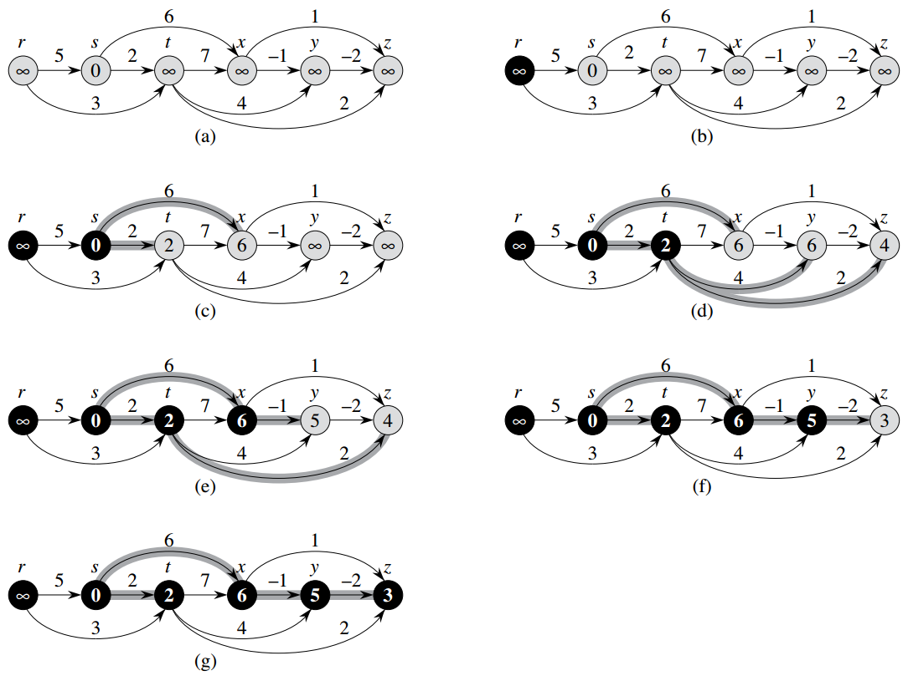

# 24.2 有向无环图中的单源最短路径问题

- `DAG`: Directed Acyclic Graph，有向无环图。
- 有向无环图，可以按照节点的拓扑排序次序来遍历，遍历节点时，松弛它的所有边。
- 时间复杂度为O(V+E)。

---

[](https://github.com/lzyerste/introduction_to_algorithms/blob/master/graph/short_path_single.py)

```python
def dag_shortest_paths(G, s, D, P):
    # 24.2, page 381
    from topological_sort import topological_sort
    nodes = topological_sort(G)
    initialize_single_source(G, s, D, P)
    for u in nodes:
        for v in G[u]:
            relax(G, u, v, D, P)
```



Figure 24.5