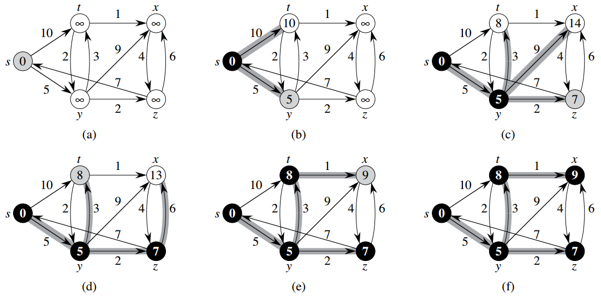

# 24.3 Dijkstra算法

- Dijkstra算法适用于带权重（`非负值`）的有向图上的单元最短路径问题。
- Dijkstra算法属于贪心策略，时间复杂度为O(ElgV)。
- 它类似于Prim算法，始终维护一个已确定最短路径的节点集合S，接下来要做的是在剩余节点中，寻找离集合S最近的节点，加入到集合S中，然后对该节点的边做relax。
- 使用`最小堆`数据结构。
    - 因为Python的heapq不能直接decrease-key，所以，实现Dijkstra的时候，最小堆中可以存在同一节点的多个距离值，只是其中的最小值才会起真正作用，其余的遇到时过滤掉即可。
    - heapq里的项为<distance, node>

---

```python
def dijkstra(G, s, D, P):
    # 24.3, page 383
    import heapq

    initialize_single_source(G, s, D, P)
    vis = set()
    Q = [(D[u], u) for u in G]
    heapq.heapify(Q)  # one node may have multiple distances
    while Q:
        d, u = heapq.heappop(Q)
        if u in vis: continue
        vis.add(u)  # d == D[u] here
        for v in G[u]:
            if D[u] + G[u][v] < D[v]:  # relax
                D[v] = D[u] + G[u][v]
                P[v] = u
                heapq.heappush(Q, (D[v], v))
```



Figure 24.6