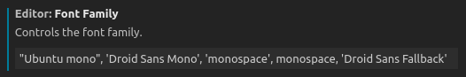

#vscode #神器 #必备

## 配置文件

- 配置同步：使用 Settings Sync 插件（不使用 vscode 自带 sync）
    - https://gist.github.com/lzyerste/444ea2413fcc574ae506f55467d938e2
    - 主要同步系统设置及快捷键习惯。
    - 支持多个平台，Ubuntu 及 Mac，以 Ubuntu 习惯为准。Ubuntu 跟 Mac 有各自的快捷键文件，注意同步。
    - 不同机器使用的插件不一样，所以可以不强制同步。

https://stackoverflow.com/questions/35368889/how-can-i-export-settings

Linux：`~/.config/Code/User`，主要文件是 `settings.json` 和 `keybindings.json`。

项目的配置文件主要是目录`.vscode`。

## 插件推荐

### 插件列表

有些并没有启用。

```c
$ code --list-extensions
austin.code-gnu-global
bungcip.better-toml
CoenraadS.bracket-pair-colorizer
cschlosser.doxdocgen
dracula-theme.theme-dracula
eamodio.gitlens
Equinusocio.vsc-community-material-theme
Equinusocio.vsc-material-theme
equinusocio.vsc-material-theme-icons
ezforo.copy-relative-path-and-line-numbers
jaycetyle.vscode-gnu-global
joeylu-vscode.fuzzy-tag
josetr.cmake-language-support-vscode
mads-hartmann.bash-ide-vscode
mhutchie.git-graph
mine.cpplint
ms-dotnettools.vscode-dotnet-runtime
ms-python.python
ms-python.vscode-pylance
ms-toolsai.jupyter
ms-toolsai.jupyter-keymap
ms-toolsai.jupyter-renderers
ms-toolsai.vscode-jupyter-cell-tags
ms-toolsai.vscode-jupyter-slideshow
ms-vscode-remote.remote-ssh
ms-vscode-remote.remote-ssh-edit
ms-vscode-remote.remote-wsl
ms-vscode.cmake-tools
ms-vscode.cpptools
ms-vscode.remote-explorer
rsbondi.highlight-words
rust-lang.rust-analyzer
ryuta46.multi-command
Shan.code-settings-sync
TabNine.tabnine-vscode
twxs.cmake
VisualStudioExptTeam.intellicode-api-usage-examples
VisualStudioExptTeam.vscodeintellicode
vscodevim.vim
yzhang.markdown-all-in-one
zhuangtongfa.material-theme
```

### One Dark Pro，主题

❤❤❤❤❤

### Vim

❤❤❤❤❤

使用 vim 模式。

### GitLens

❤❤❤❤❤

每行显示 git 信息。可能会比较耗资源，可以进入 Zen 模式。

### C/C++相关插件

- C++ Intellisense：依赖 gtags
	- 官方不推荐了？会不会影响写代码提示？会的。这个插件继续保留。
	- 比如提示其他文件的 static 函数
- C/C++ for Visual Studio Code
- Fuzzy Tag For C/C++：模糊搜索，ctags，F10
- Doxygen Documentation Generator：生成注释文档模板
- ~~C/C++ GNU Global~~

需要搭配好 c++配置文件，选好 include 路径。

### Settings Sync，同步配置

使用 gist。

### ❌Bracket Pair Colorizer，括号颜色高亮

比较耗资源。

vscode 有自带了。

### ❌TabNine，AI 代码提示

比较耗资源。

### Git Graph

在 vscode 里较好地图形化显示 git 信息，与 remote ssh 集成较好，勉强替换下 sublime merge。

---

升级 vscode 后，git graph 界面不显示，报错 webview 相关。

解决：退出 vscode，然后搜索 vscode 进程，彻底杀掉，重新进入 vscode。

```c
$ ps -ef | grep code/code

lzy        13292    2195  0 Jul12 ?        00:22:56 /usr/share/code/code --no-sandbox --unity-launch

$ sudo kill -9 13292
```

## Tips

### ssh 不能保存

检查下目录的权限，用户名是否是自己，有可能变为 root 了。

### 代码提示出问题

可能是 gtag 产生的索引文件坏掉了，重新生成。

### 头文件搜索

```cpp
You can also open/generate the c_cpp_properties.json file
via the C/Cpp: Edit Configurations command from the Command Palette (⇧⌘P).
```

```cpp
{
    "configurations": [
        {
            "name": "Linux",
            "includePath": [
                "${workspaceFolder}/**",
                "/usr/src/linux-headers-4.15.0-29-generic/include"
            ],
            "defines": [],
            "compilerPath": "/usr/bin/gcc",
            "cStandard": "c11",
            "cppStandard": "c++17",
            "intelliSenseMode": "clang-x64"
        }
    ],
    "version": 4
}
```

### 搜索私有函数

修改 C++插件设置，默认是只搜索头文件，打开全搜。但是打开大工程会不会有性能影响？


### 隐藏文件

[How do I hide certain files from the sidebar in Visual Studio Code?](https://stackoverflow.com/questions/30140112/how-do-i-hide-certain-files-from-the-sidebar-in-visual-studio-code)

```bash
// Workspace settings (.vscode/settings.json)
{
    // The following will hide the js and map files in the editor
    "files.exclude": {
        "**/*.js": true,
        "**/*.map": true
    }
}
```

### Ubuntu 下终端不显示下划线

终端 terminal 的字体可以改为 Ubuntu mono，编辑器的字体可以是其他的：

[New terminal lines rendering cuts off bottom/top of characters like underscore · Issue #35901 · microsoft/vscode](https://github.com/microsoft/vscode/issues/35901)


---

修改字体为`Ubuntu mono`：同时大小改为 16 比较顺眼



### 调试 Python 的时候，报错 add_command

```python
pydevd_comm.py", line 353, in add_command self.cmdQueue.put(cmd)
```

解决办法：删除自定义的 PYTHONPATH，在~/.zshrc，然后就好了

[PyCharm debugger fails with AttributeError](https://stackoverflow.com/questions/37181768/pycharm-debugger-fails-with-attributeerror)

### 远程开发，支持跳板机

远程开发功能已经自带，Remote SSH 即可。

[SSH 通过跳板机直接访问内网机器 - 知乎](../vscode/远程开发，支持跳板机/跳板机说明/SSH%20通过跳板机直接访问内网机器%20-%20知乎.md)

假设自己的机器是 A，跳板机为 J，目标机为 T。A 不能直接连目标机 T。

1. 将 A 的公钥分别加入到 J 和 T。
2. 修改 A 的.ssh/config，配置跳板流程

    ```python
    Host shannon
            HostName www.shannon-data.com
            Port 2201
            User luzhongyong
            IdentityFile "/Users/Lu-macbook/.ssh/id_rsa"
            ServerAliveInterval 10
            ServerAliveCountMax 99

    Host lzyerste-pcu
            HostName 172.17.41.238
            User lzyerste
            ProxyJump shannon
    ```

这样就可以直接 ssh lzyerste-pcu 了，而且 ssh 文件拷贝可以照常进行。

vscode 远程时可以直接连接 lzyerste-pcu。

如果不支持命令 ProxyJump 的话，可以试试

```python
Host test
	HostName 172.17.41.49
	User shannon
	ProxyCommand ssh -W %h:%p app
```