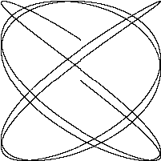

# lissajous

Desc: Lissajous generates GIF animations of random Lissajous figures.
Source: gopl.io/ch1/lissajous
备注: const
有web版本，带上参数web
章节: 1.4



```go
// Copyright © 2016 Alan A. A. Donovan & Brian W. Kernighan.
// License: https://creativecommons.org/licenses/by-nc-sa/4.0/

// Run with "web" command-line argument for web server.
// See page 13.
//!+main

// Lissajous generates GIF animations of random Lissajous figures.
package main

import (
	"image"
	"image/color"
	"image/gif"
	"io"
	"math"
	"math/rand"
	"os"
)

//!-main
// Packages not needed by version in book.
import (
	"log"
	"net/http"
	"time"
)

//!+main

var palette = []color.Color{color.White, color.Black}

const (
	whiteIndex = 0 // first color in palette
	blackIndex = 1 // next color in palette
)

func main() {
	//!-main
	// The sequence of images is deterministic unless we seed
	// the pseudo-random number generator using the current time.
	// Thanks to Randall McPherson for pointing out the omission.
	rand.Seed(time.Now().UTC().UnixNano())

	if len(os.Args) > 1 && os.Args[1] == "web" {
		//!+http
		handler := func(w http.ResponseWriter, r *http.Request) {
			lissajous(w)
		}
		http.HandleFunc("/", handler)
		//!-http
		log.Fatal(http.ListenAndServe("localhost:8000", nil))
		return
	}
	//!+main
	lissajous(os.Stdout)
}

func lissajous(out io.Writer) {
	const (
		cycles  = 5     // number of complete x oscillator revolutions
		res     = 0.001 // angular resolution
		size    = 100   // image canvas covers [-size..+size]
		nframes = 64    // number of animation frames
		delay   = 8     // delay between frames in 10ms units
	)
	freq := rand.Float64() * 3.0 // relative frequency of y oscillator
	anim := gif.GIF{LoopCount: nframes}
	phase := 0.0 // phase difference
	for i := 0; i < nframes; i++ {
		rect := image.Rect(0, 0, 2*size+1, 2*size+1)
		img := image.NewPaletted(rect, palette)
		for t := 0.0; t < cycles*2*math.Pi; t += res {
			x := math.Sin(t)
			y := math.Sin(t*freq + phase)
			img.SetColorIndex(size+int(x*size+0.5), size+int(y*size+0.5),
				blackIndex)
		}
		phase += 0.1
		anim.Delay = append(anim.Delay, delay)
		anim.Image = append(anim.Image, img)
	}
	gif.EncodeAll(out, &anim) // NOTE: ignoring encoding errors
}

//!-main
```