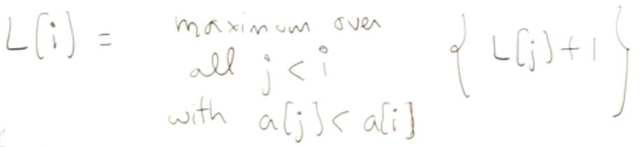
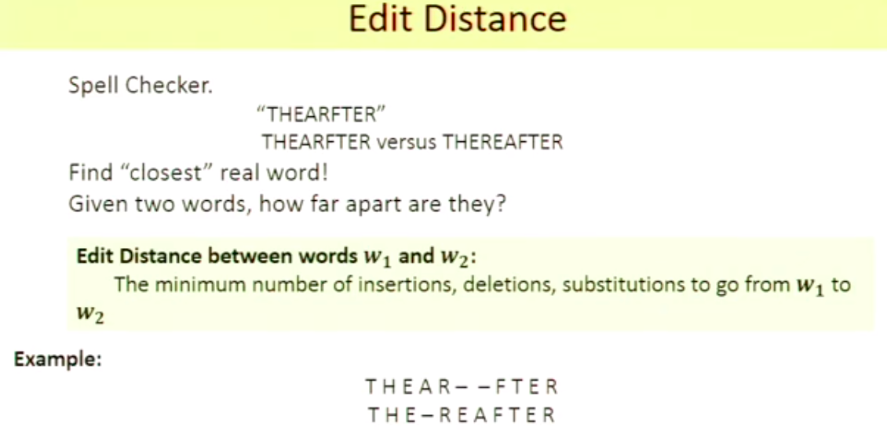

# P13: Dynamic Programming

- Longest Increasing Subsequence, LIS
    - [7, 3, 5, 6, 8, 2, 10, 4, 9, 1]
    - 方法一：转为Graph，DAG
        - Subproblem: `L[i]` = length of LIS ending at a[i]
        - Recurrence Relation，递推式
            
            
            
        - iterative call VS. recursive call
        - 递归也是可以的，但要加上记忆（memorization），防止重复计算
- Optimal Gambling
- Edit Distance
    
    
    
-