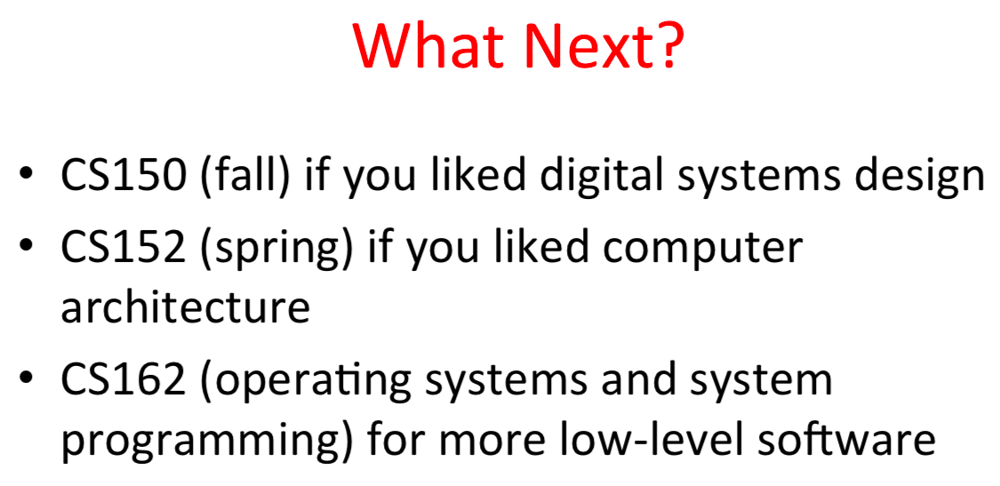

# 2015 Spring

[CS61C Spring 2015: Great Ideas in Computer Architecture (Machine Structures)](Machine Structures))](http://inst.eecs.berkeley.edu/~cs61c/sp15/)

课程官网

B站视频

We will be using the fifth edition of Patterson and Hennessy's `Computer Organization and Design` book ("P&H"), ISBN 0124077269.

- p07 后面画面不动了，自己去看PPT。
    - 主要讲解MIPS指令集
    - 跳转的相对偏移地址都是针对PC+4的。