# Course Introduction and the Relational Model

#: 1
Homework: https://15445.courses.cs.cmu.edu/fall2018/homework1/
Readings: Readings: Chapters 1-2, 6
Status: Done
视频: https://www.bilibili.com/video/av39731185/p1
课件: https://15445.courses.cs.cmu.edu/fall2018/slides/01-introduction.pdf

1. This course is on the **design and implementation** of `disk-oriented` database management systems.
    - This is not a course on how to use a database to build applications or how to administer a database. → See [CMU 95-703](http://www.heinz.cmu.edu/academic-resources/course-results/course-details/index.aspx?cid=273) (Heinz College)
    - *Database Applications* ([15-415/615](https://15415.courses.cs.cmu.edu/)) is cancelled this semester.
2. `Course Outline`
    - Relational Databases
    - Storage
    - Execution
    - Concurrency Control
    - Recovery
    - Distributed Databases
    - Potpourri
3. `Textbook`：《**Database System Concepts**》，6th Edition，Silberschatz, Korth, & Sudarshan
4. `Homeworks`
    - **Five** homework assignments throughout the semester.
    - First homework is a SQL assignment. The rest will be pencil-and-paper assignments.
5. `Projects`
    - You will build your own **storage manager from scratch** of the course of the semester.
    - Each project builds on the previous one.
    - C++11?
6. `DATABASE RESEARCH`
    
    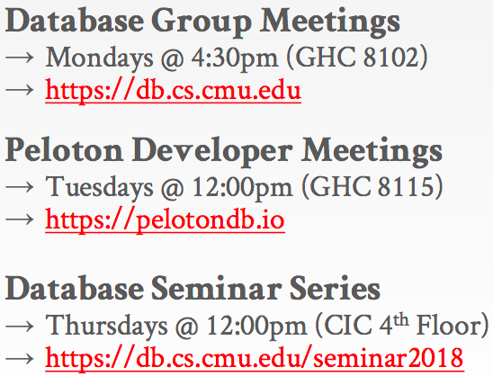
    
7. `DATABASE EXAMPLE`
    - Create a database that models a **digital music store** to keep track of **artists** and **albums**.
8. `Flat Files`
    - 比如使用csv文件格式，每一行代表一条记录
        
        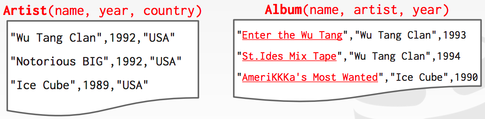
        
    - **FLAT FILES: IMPLEMENTATION**
        - How do you find a particular record?
        - What if we now want to create a new application that uses the same database?
        - What if two threads try to write to the same file at the same time?
    - **FLAT FILES: DURABILITY**
        - What if the machine **crashes** while our program is updating a record?
        - What if we want to **replicate** the database on multiple machines for high availability?
9. `DBMS`
    - 早期，逻辑层与物理层紧密相连，甚至要先知晓应用层需要执行怎样的查询，再去构建数据库，显然这种方式紧耦合，非常不通用。
    - 1970年，`EDGAR F. CODD`提出了关系模型（**relational model**），对数据库进行抽象。
        
        [A relational model of data for large shared data banks](https://dl.acm.org/citation.cfm?id=362685)
        
        - Store database in simple data structures.
        - Access data through high-level language.
        - Physical storage left up to implementation.
10. `DATA MODELS`
    - A **data model** is collection of concepts for describing the data in a database.
    - A **schema** is a description of a particular collection of data, using a given data model.
11. `模型分类`
    - **Relational**，大部分DBMS，也是这门课说介绍的
    - Key/Value → NoSQL
    - Graph → NoSQL
    - Document → NoSQL
    - Column-family → NoSQL
    - Array / Matrix → Machine Learning
    - Hierarchical → 很少
    - Network → 很少
12. `RELATIONAL MODEL`
    - **Structure**: The definition of relations and their contents.
    - **Integrity**: Ensure the database’s contents satisfy constraints.
    - **Manipulation**: How to access and modify a database’s contents.
    
    ---
    
    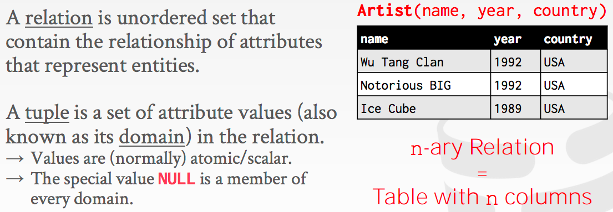
    
13. RELATIONAL MODEL: `PRIMARY KEYS`
    - A relation’s **primary key** uniquely identifies a single tuple.
    - 主键，表中唯一属性
    - 有些数据库内部会自动生成主键，比如row id
    - Auto-generation of unique integer primary keys:
    → `SEQUENCE` (SQL:2003)
    → `AUTO_INCREMENT` (MySQL)
14. RELATIONAL MODEL: `FOREIGN KEYS`
    - A foreign key specifies that an attribute from one relation has to map to a tuple in another relation.
    
    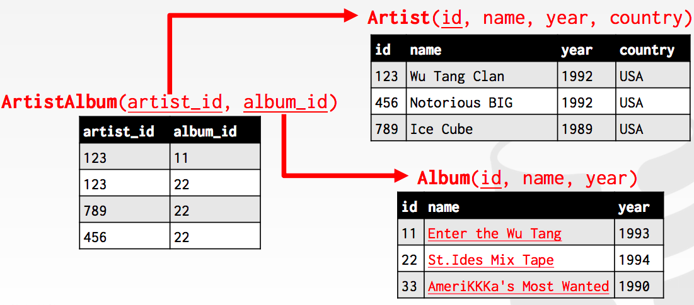
    
    ArtistAlbum表中保存的就是2个外键，指向Artist与Album表。
    
15. `RELATIONAL ALGEBRA`
    - Fundamental operations to retrieve and manipulate tuples in a relation.
    → Based on **set algebra**.
    - Each operator takes one or more relations as its inputs and outputs a **new relation**.
    → We can “**chain**” operators together to create more complex operations.
    
    [Relational Algebra in DBMS with Examples](https://www.guru99.com/relational-algebra-dbms.html)
    
    
    
    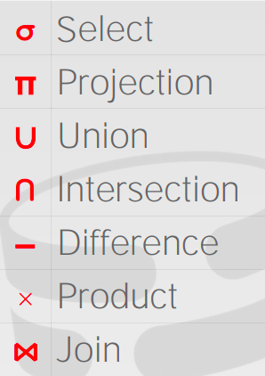
    
16. RELATIONAL ALGEBRA: `**SELECT**`
    
    根据某些过滤条件挑选出子集，输出的表结构属性仍保持不变
    
    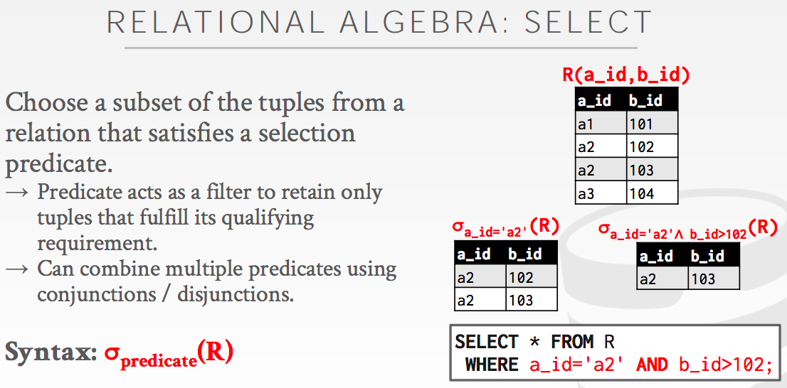
    
17. RELATIONAL ALGEBRA: `PROJECTION`
    
    选择表结构的部分属性，属性的顺序也可以调整，值还可以进行简单的计算
    
    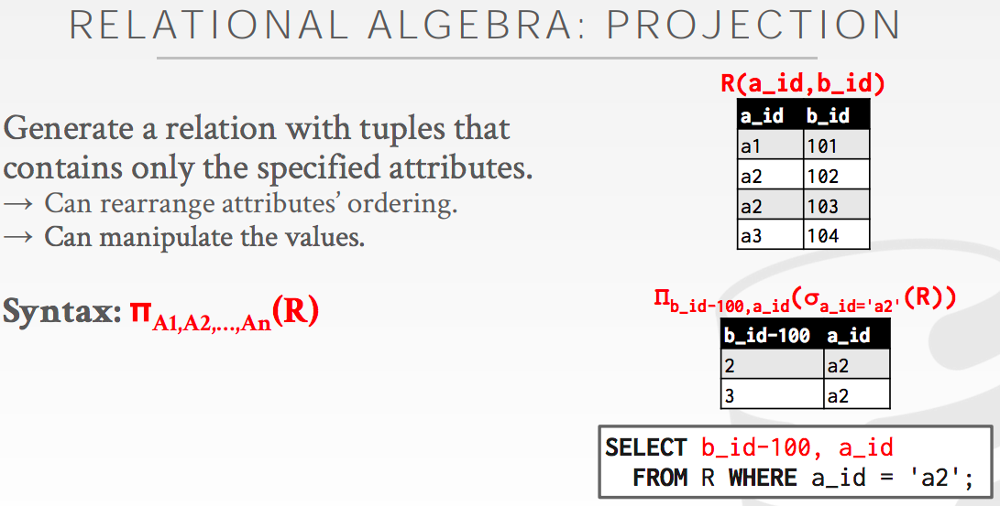
    
18. RELATIONAL ALGEBRA: **`UNION`**
    
    两张表结构要一样，需不需要去重（看网上其他资料都是去重的）？比如下面的<a3, 103>在结果中出现2次。顺序不重要。
    
    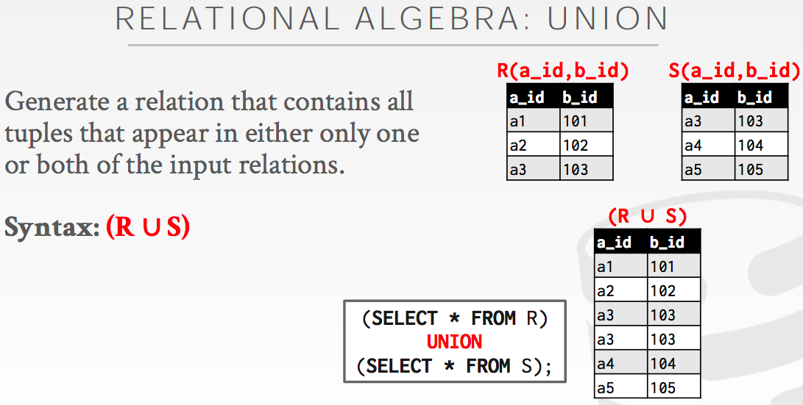
    
19. RELATIONAL ALGEBRA: `INTERSECTION`
    
    交集，两张表结构要一样
    
    在R表和S表中都存在的记录
    
    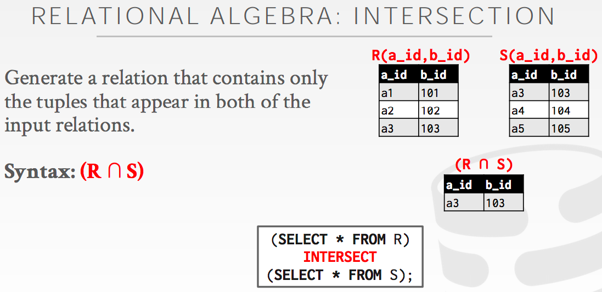
    
20. RELATIONAL ALGEBRA: `DIFFERENCE`
    
    差集，两张表结构要一样
    
    R表存在，S表不存在的记录
    
    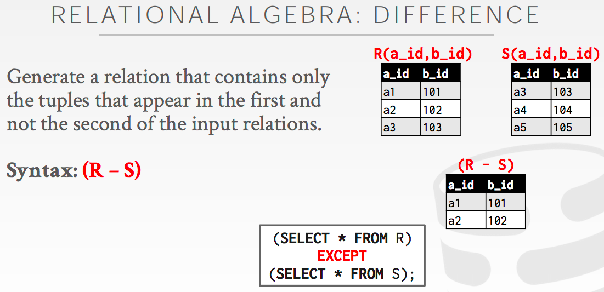
    
21. RELATIONAL ALGEBRA: `PRODUCT`
    
    也叫笛卡尔积，或者cross join，cross product。两张表的所有组合，相当于两层for循环
    
    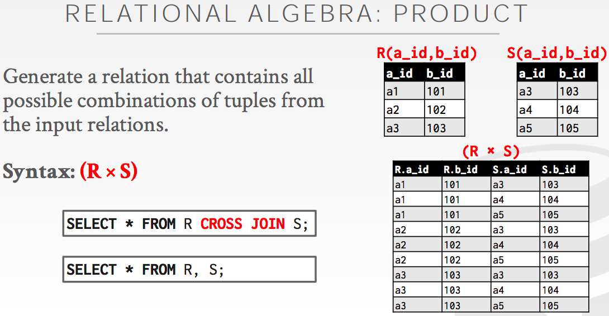
    
22. RELATIONAL ALGEBRA: `JOIN`
    
    [SQL JOIN](http://www.w3school.com.cn/sql/sql_join.asp)
    
    Join operation is essentially a cartesian product followed by a selection criterion.
    
    **思考的时候，可以先展开为笛卡尔积（左右两栏），然后根据具体的join类型，将不符合要求的记录给移除掉。**
    
    下面的是natural join，也就是根据两表的共同属性（a_id, b_id），将相等的记录挑选出来，如下面的<a3, 103>。
    
    这里的结果看起来跟intersection一样，但要注意，intersection要求两张表的结构完全一样（包括名字及顺序），而natural join则不是，如下面的S表结构可以是S(a_id, s_id)。那么，做natural join的时候，就只用比较属性a_id，结果会是<a_id, b_id, s_id>。
    
    笛卡尔积的输出包含了两张表的所有属性，而natural join则将相同属性去重了，比如结果中a_id只出现一次。
    
    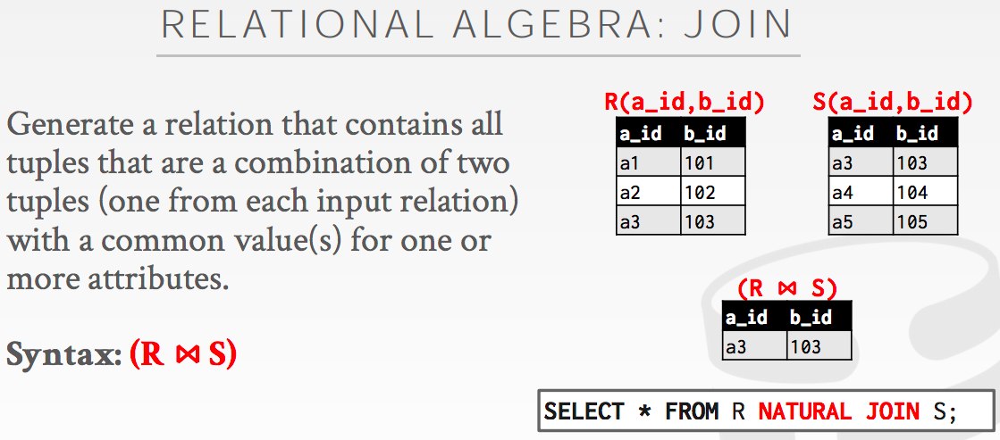
    
    JOIN操作实际可细分为Inner Join跟Outer Join。
    
    Inner Join包括：
    
    - Theta Join，有过滤判断条件
    - EQUI Join，根据某属性的相等性。难以高效实现
    - Natural Join，根据共同属性
    
    Outer Join只是在另一表没有匹配的情况，填充NULL：
    
    - Left Outer Join，以左表为主，右表的属性可能填充为NULL
    - Right Outer Join，以右表为主，左表的属性可能填充为NULL
    - Full Outer Join，左右表都要顾虑
23. RELATIONAL ALGEBRA: `EXTRA OPERATORS`
    
    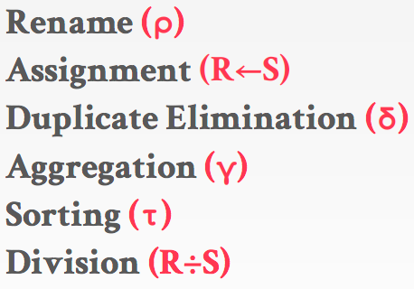
    
24. OBSERVATION
    
    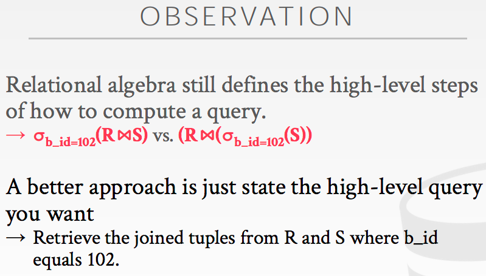
    
25. RELATIONAL MODEL: `QUERIES`
    
    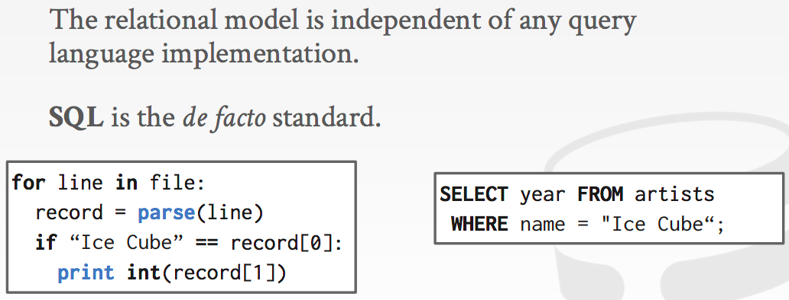