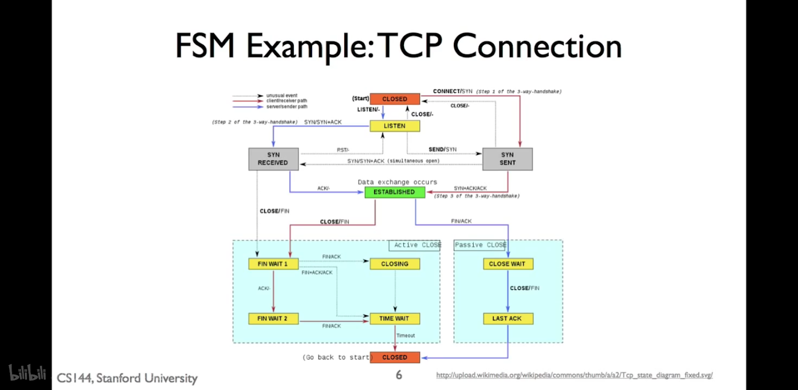
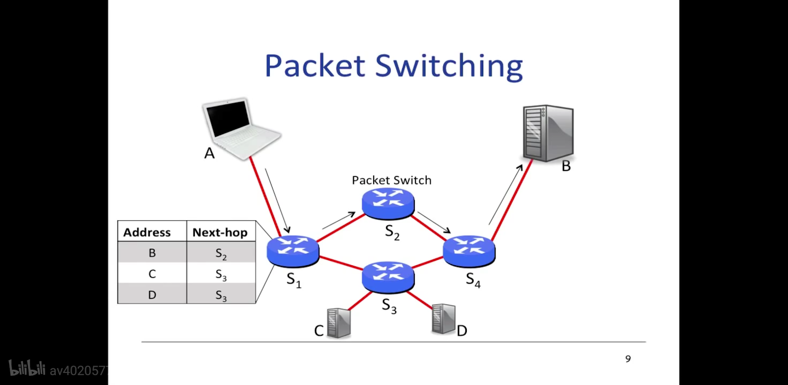
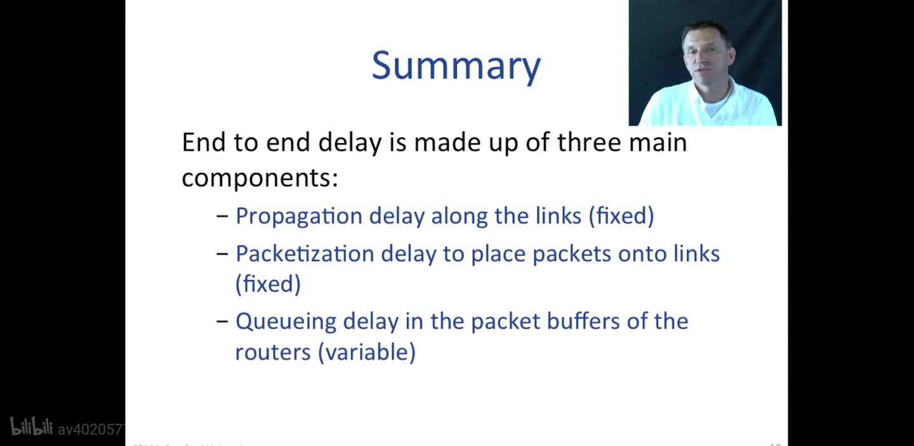

# 2013 Fall

[Introduction to Computer Networking](https://lagunita.stanford.edu/courses/Engineering/Networking-SP/SelfPaced/about)

课程主页

[](https://www.bilibili.com/video/av40205778)

[](https://www.bilibili.com/video/av39441624)

备选，有guest lecture

教材：《Computer Networking: A Top-Down Approach》，现在有第7版

- 大小头（网络是大头表示）
    
    ```python
    				D 小头
    				C
    				B
    				A
    A B C D
    				A 大头
    				B
    				C
    				D
    从上往下表示地址从低到高。
    中间的ABCD表示数字，左边是MSB，右边是LSB。
    大头是顺时针转，小头是逆时针转。
    ```
    
- ARP协议，IP转MAC地址，Link层
- DNS协议：使用UDP
- HTTP协议：基于TCP
- ICMP协议：传输层
    - ping命令
    - traceroute
- `TCP`
    - 带连接的
    - 可靠的
    - sliding window：按序滑动，按序确认，丢失重发
    - 三次握手，四次挥手
    
    
    
- `Packet Switching`
    - 端到端延迟：传播时间+发包时间+排队时间
        - 类似坐高铁，先是在站台等待，然后高铁到站所有人上车（这里有点不一样），然后高铁前往下一站
        - 网络上是一个个bit直接发，高铁是等旅客都上了后一起发
    
    
    
    
    
- FDM
    
    [https://www.youtube.com/watch?v=aeC_yOzA0xo](https://www.youtube.com/watch?v=aeC_yOzA0xo)