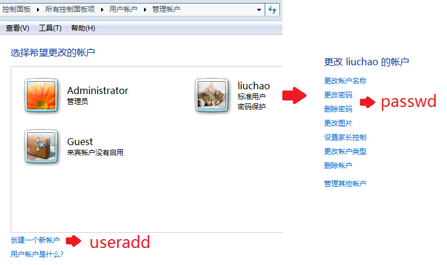
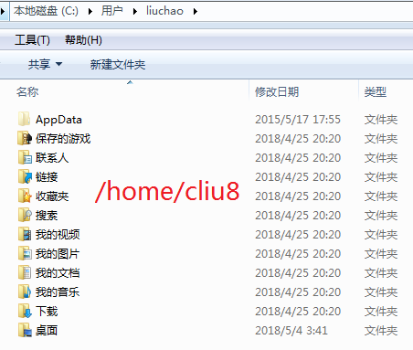
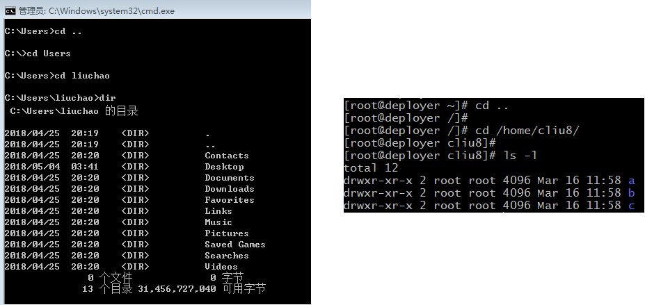
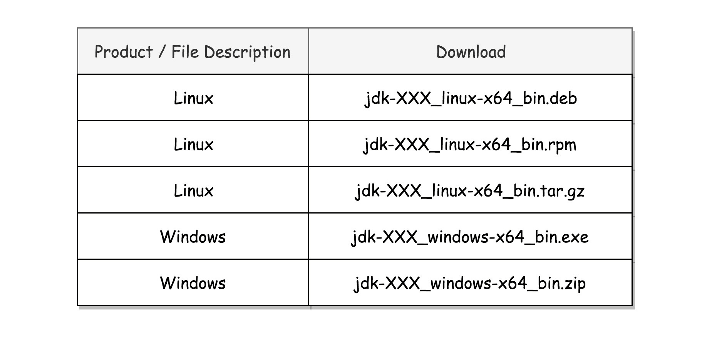
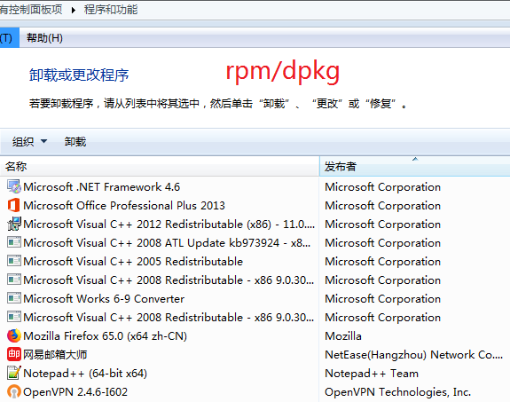
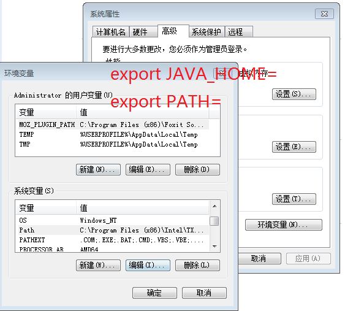
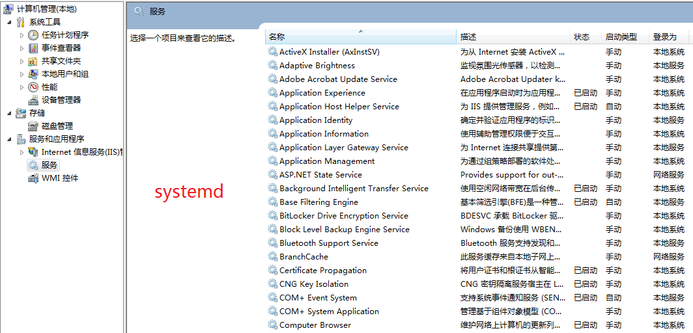
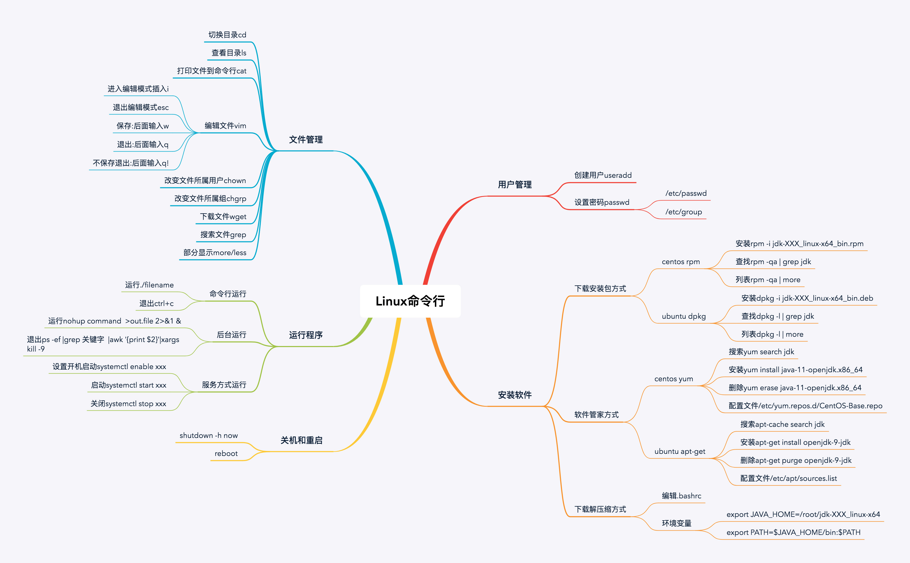

# 04 | 快速上手几个Linux命令：每家公司都有自己的黑话

[04 | 快速上手几个Linux命令：每家公司都有自己的黑话-极客时间](https://time.geekbang.org/column/article/88761)


```python
# passwd
Changing password for user root.
New password:
```

```python
useradd cliu8
```

```python
[root@deployer ~]# useradd -h
Usage: useradd [options] LOGIN
       useradd -D
       useradd -D [options]

Options:
  -g, --gid GROUP               name or ID of the primary group of the new account
```



```python
# cat /etc/passwd
root:x:0:0:root:/root:/bin/bash
......
cliu8:x:1000:1000::/home/cliu8:/bin/bash

# cat /etc/group
root:x:0:
......
cliu8:x:1000:
```





```python
# ls -l
drwxr-xr-x 6 root root    4096 Oct 20  2017 apt
-rw-r--r-- 1 root root     211 Oct 20  2017 hosts
```





```python
[base]
name=CentOS-$releasever - Base - 163.com
baseurl=http://mirrors.163.com/centos/$releasever/os/$basearch/
gpgcheck=1
gpgkey=http://mirrors.163.com/centos/RPM-GPG-KEY-CentOS-7
```

```python
deb http://mirrors.163.com/ubuntu/ xenial main restricted universe multiverse
deb http://mirrors.163.com/ubuntu/ xenial-security main restricted universe multiverse
deb http://mirrors.163.com/ubuntu/ xenial-updates main restricted universe multiverse
deb http://mirrors.163.com/ubuntu/ xenial-proposed main restricted universe multiverse
deb http://mirrors.163.com/ubuntu/ xenial-backports main restricted universe multiverse
```

```python
yum install zip.x86_64 unzip.x86_64
apt-get install zip unzip
```



```python
export JAVA_HOME=/root/jdk-XXX_linux-x64
export PATH=$JAVA_HOME/bin:$PATH
```

```python
ps -ef |grep 关键字  |awk '{print $2}'|xargs kill -9
```



