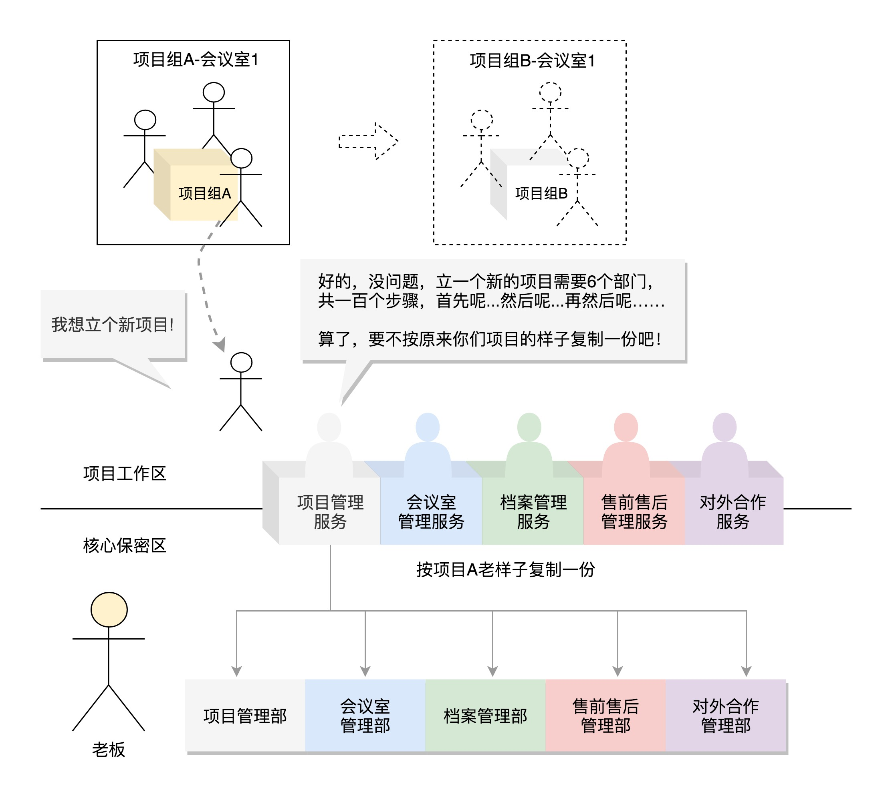
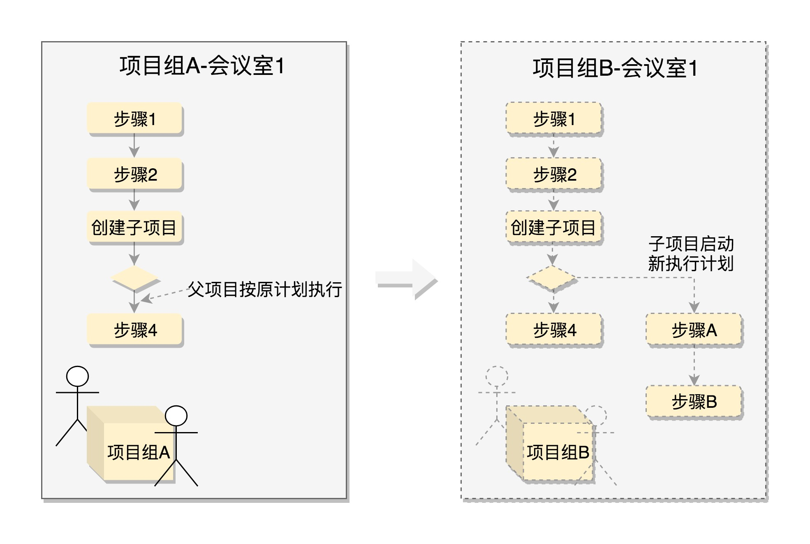
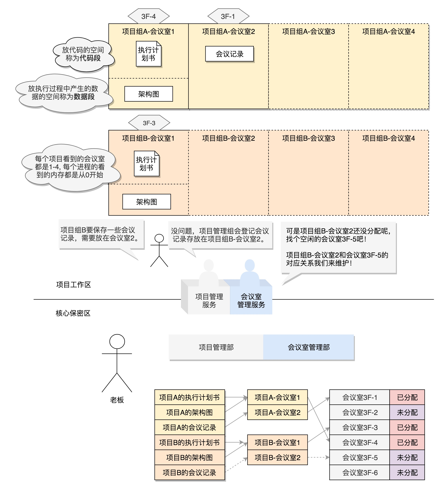
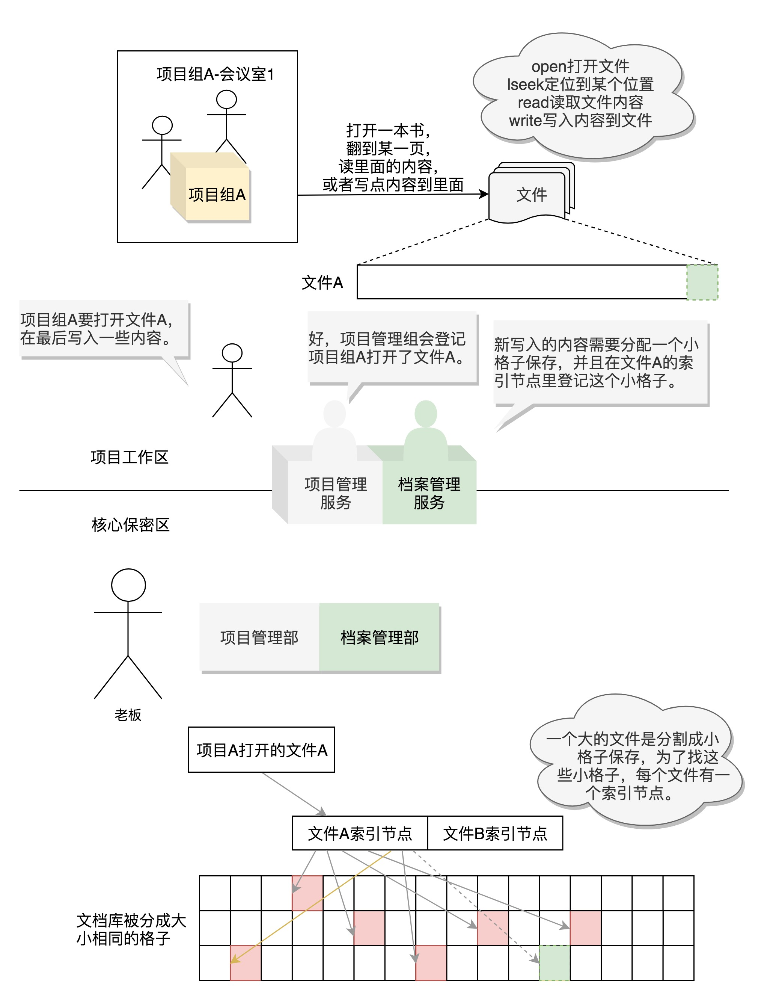
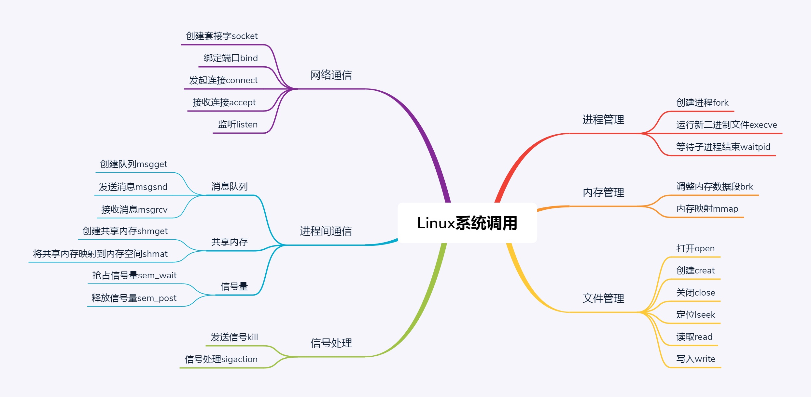

# 05 | 学会几个系统调用：咱们公司能接哪些类型的项目？

[05 | 学会几个系统调用：咱们公司能接哪些类型的项目？-极客时间](https://time.geekbang.org/column/article/89251)









```python
unistd_64.h

#define __NR_restart_syscall    0
#define __NR_exit      1
#define __NR_fork      2
#define __NR_read      3
#define __NR_write      4
#define __NR_open      5
#define __NR_close      6
#define __NR_waitpid      7
#define __NR_creat      8
......
```

