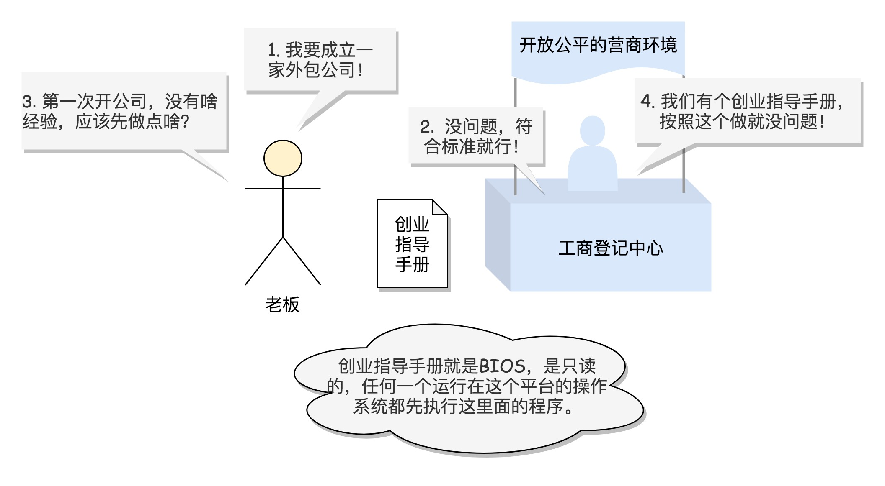
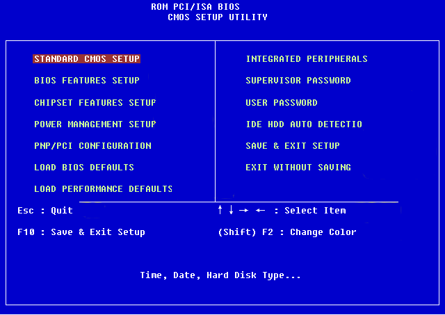
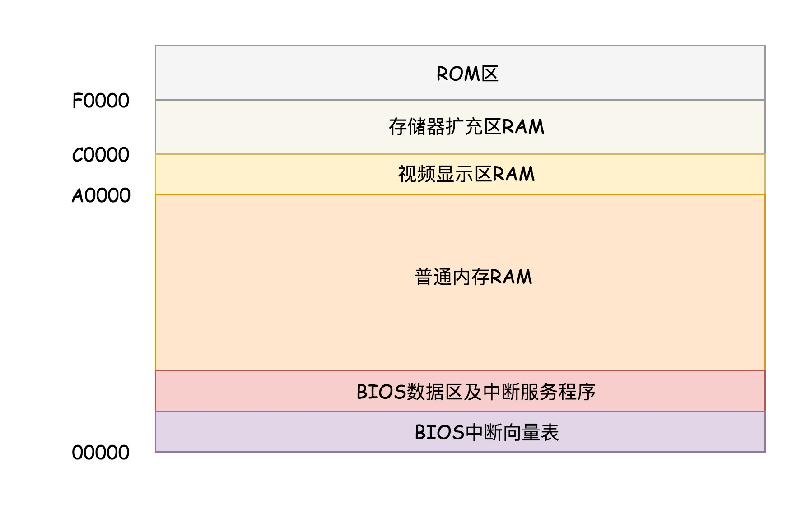
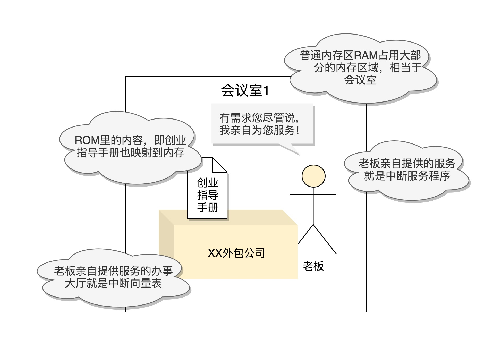
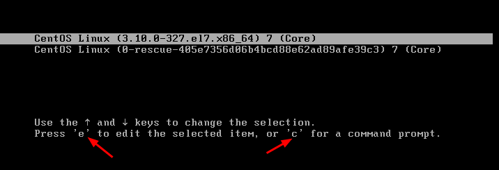
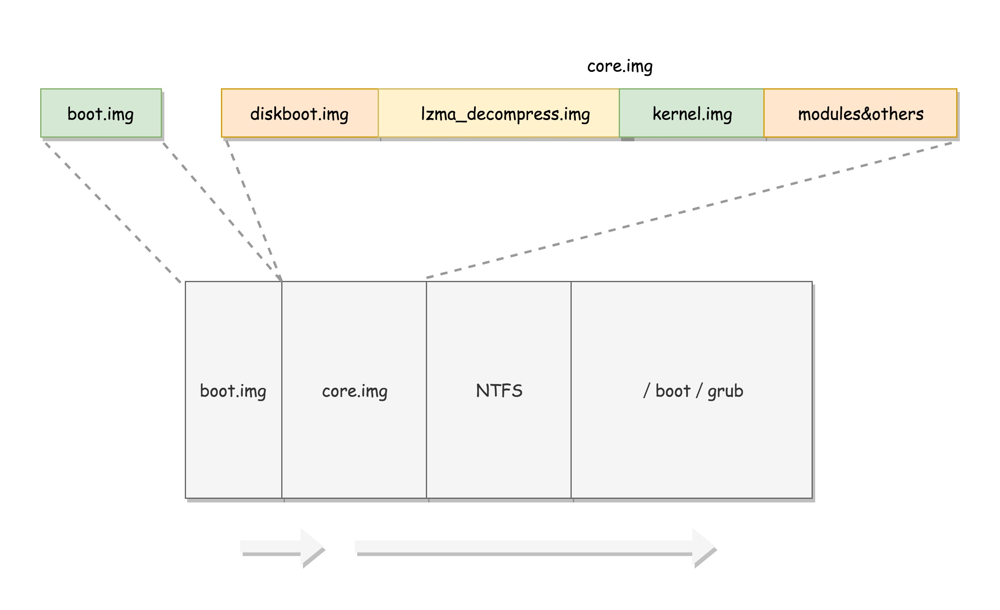
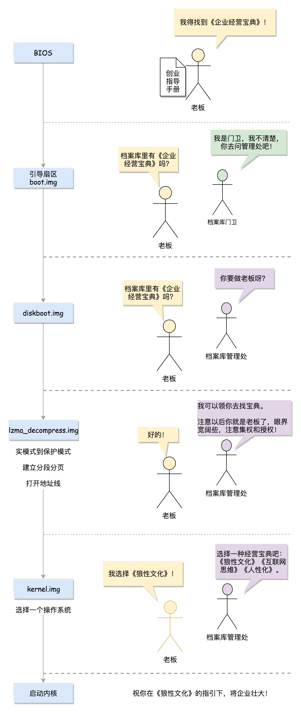

# 07 | 从BIOS到bootloader：创业伊始，有活儿老板自己上









```python
menuentry 'CentOS Linux (3.10.0-862.el7.x86_64) 7 (Core)' --class centos --class gnu-linux --class gnu --class os --unrestricted $menuentry_id_option 'gnulinux-3.10.0-862.el7.x86_64-advanced-b1aceb95-6b9e-464a-a589-bed66220ebee' {
  load_video
  set gfxpayload=keep
  insmod gzio
  insmod part_msdos
  insmod ext2
  set root='hd0,msdos1'
  if [ x$feature_platform_search_hint = xy ]; then
    search --no-floppy --fs-uuid --set=root --hint='hd0,msdos1'  b1aceb95-6b9e-464a-a589-bed66220ebee
  else
    search --no-floppy --fs-uuid --set=root b1aceb95-6b9e-464a-a589-bed66220ebee
  fi
  linux16 /boot/vmlinuz-3.10.0-862.el7.x86_64 root=UUID=b1aceb95-6b9e-464a-a589-bed66220ebee ro console=tty0 console=ttyS0,115200 crashkernel=auto net.ifnames=0 biosdevname=0 rhgb quiet 
  initrd16 /boot/initramfs-3.10.0-862.el7.x86_64.img
}
```





